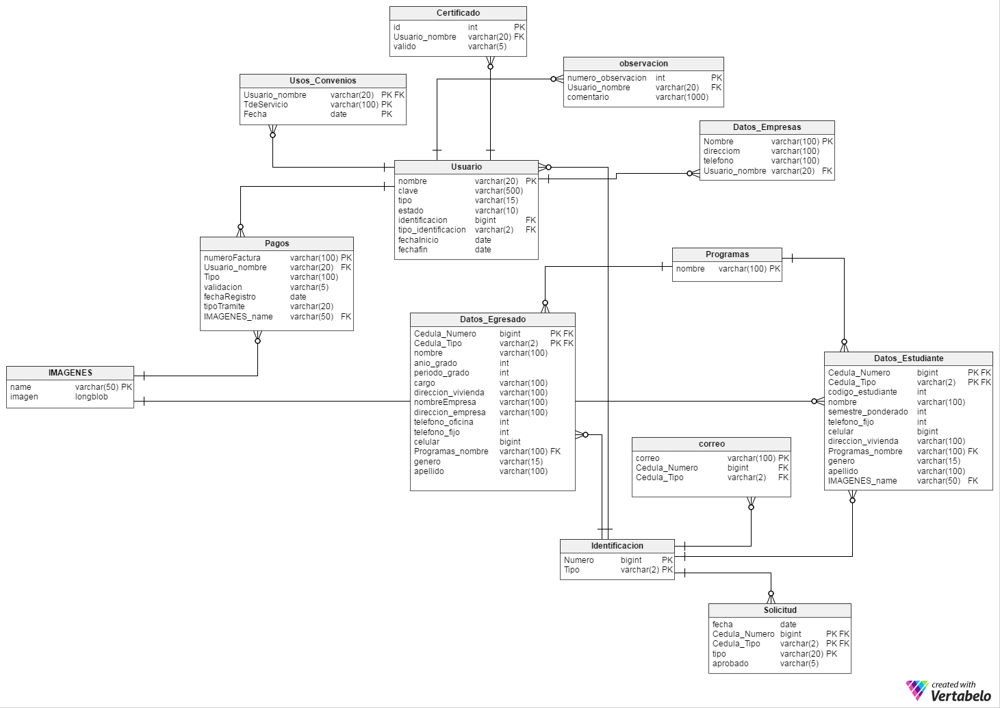

# Proyecto PDSW GRUPO 3 Aeci_web

Autores: Cristian Fernando  Mendivelso Sanabria
         Christian Soto Anaya
         Miguel Angel Rojas Martinez
         David Sebastian Reina Castiblanco  
         Jessica Catherine Fresneda Hernadez
        
Procesos de desarrollo de software (PDSW)
Escuela Colombiana de Ingenieria Julio Garavito

Descripción Proyecto:

Este proyecto busca satisfacer la necesidad de la Asociacion de Egresados de  la Escuela Colombiana de ingenieria Julio Garavito(AECI) en cuanto a construir una plataforma que se adecue en sus totalidad a todos los multiples beneficios que esta ofrece , buscando asi beneficiar  tanto al cordinador como a los afiliados (egresados y estudiantes).

MODELO RELACIONAL

DIAGRAMA DE CLASES

URL DEL REPOSITORIO 
https://github.com/DavidReina/ProyectoEciGrp3

URL DE LA APLICACION EN HEROKU
https://pypdswgrp3.herokuapp.com/

URL DEL ESPACIO DE CIRCLE DEL PROYECTO
https://circleci.com/gh/DavidReina/ProyectoEciGrp3

